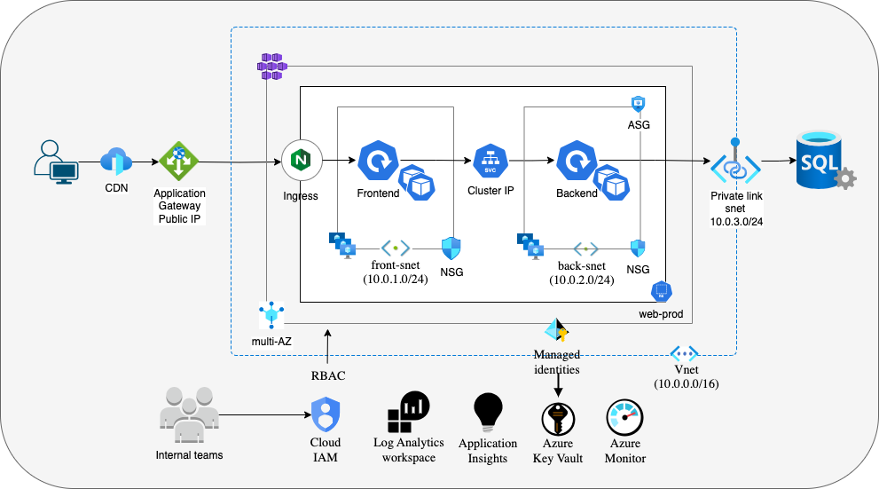

# Part 1 - AKS Cluster Architecture and design

## 1. Architecture Diagram

### Overview

This document outlines the **3-tier application architecture** hosted in **Azure Kubernetes Service (AKS)**

#### **AKS Cluster Environments Setup**

(Requirement: Build "a" non-production and "a" production cluster)

#### **Non-Production Cluster**

- **VNet:** Dedicated Virtual Network.
- **Public IP:** Configured but restricted to **trusted network access only**.
- **Availability:** Single **Availability Zone (AZ)**.
- **Purpose:** Used for testing, development, and performance validation before moving to production.
- **Future Scaling:** If multiple **non-production** clusters are allowed , the recommended environments are:
  - **Sandpit** - Platform team experiments and PoC.
  - **Development** - Active feature development and integration.
  - **Staging (UAT/Pre-Prod)** - User acceptance testing & (Performance) before production release (configs similar to PROD)

#### **Production Cluster**

- **VNet:** Dedicated Virtual Network with DDoS protection enabled.
- **Public IP:** Exposed to the Internet. with a **Azure CDN** service for serving static contents.
- **Availability:** Multi **Availability Zone (AZ)** for high availability.

## 2. Design Annotations

### Overview

- **AKS Cluster:** Production Standard (to start with) grade for production cluster and dev/test for non-production.
- **VNet:** A separate VNet for different environments , with only the production VNet having DDoS protection enabled.
  Three subnets, one for frontend pool, one for backend and one for the private link.
- **Node Pools:** Two node pools, one for frontend and one for backend
  - **Frontend:** Only for frontend apps, deployment will have node affinity set to frontend pool
  - **Backend:** Only for backend apps, deployment will have node affinity set to backend pool

### Security

- **WAF and rate-limiting:** In the Application Gateway, we can set WAF to `Prevention` mode. Also set rate-limiting
  for particular requests like `/api` so the backend components and databases are not flooded with too many requests.
- **Separate Subnets:** Isolate the frontend and backend nodes with separate subnets. Intent is to have Network Security Group between the backend subnet and the Azure Private Link Subnet, in-addition to scaling independently.
- **Network Security Group:**
  - **Alow** - HTTPS over internet to Frontend Subnet on 443
  - **Alow** - HTTP and HTTPS from frontend subnet to backend subnet
  - **Alow** - Allow backend subnet to Azure SQL DB on 1433
  - **Deny** - Deny all other
- **Application Security Group:**
  - Frontend ASG → Allow HTTPS (443) from Internet
  - Backend ASG → Allow traffic only from ASG-Frontend
  - DB ASG → Allow traffic only from ASG-Backend
- **Encryption**
  - TLS all the way, till the edge.
  - Backend to DB is via PrivateLink and is still a TLS, so encrypted in transit.
  - Azure SQL DB is encrypted at rest.
- **Private Link:**
  - Ensure database traffic never leaves Azure network.
  - Assign a private IP to database with the same VNet.
  - Use a private DNS Zone to resolve the database's private endpoint.
- **Vulnerability scanning:**
  - Use Microsoft Defender for scanning workloads for vulnerabilities runtime and in container registry.
- **Deny write access to Prod cluster**
  - Write access to Prod cluster only for service accounts. No user can delete / create / patch workloads in PROD cluster
- **Azure Key Vault:** Load all secrets and passwords to Azure Key vault. Utilise the Key vault CSI driver integration
  to fetch secrets from workloads

### Policies

#### RBAC

- Implement Azure RBAC (IAM) and Kubernetes RBAC together to enforce secure access control in an AKS cluster.

- **Use Azure AD Groups**: Manage user identities and permissions centrally.
- **Create custom IAM role**: Custom IAM roles for cluster admin, namespace admin, developer access, read-only access to cluster.
- **Map IAM roles to Azure AD groups**: Create AD groups and map IAM roles.
- **Azure AD Groups to K8s RBAC**: Grant fine-grained access to cluster resources with K8s - Roles and Rolebinding (AD groups)

#### Pod Security

- Create pod security standards and [label namespaces](https://learn.microsoft.com/en-us/azure/aks/use-psa) to enforce pod
  security policy like `privileged` and `rootAccess`

#### Open Policy Agent (OPA)

- To enforce policies beyond K8s cluster (eg RBAC, network etc). Pre-admission (acts before resources are created)

#### Kubernetes network policies

- Enforce Kubernetes network policies in addition to ASG (re-enforcing security).
  eg: only workloads labelled with `app: frontend` can talk to backend app.

####

### Network

- A separate VNet for each environment.
- PrivateLink for securely accessing the external database
- VPN Gateway/ ExpressRoute for connecting to on-prem network (Hub & Spoke)
- Firewall: In addition to NSG and ASG, create firewall rules to enforce network security.
  - Azure Firewall to enforce security between the different Azure services
    eg: AKS can talk to Container registry to pull images.

### Cost Management

- **Right-sizing resources:** Specify only what is required for CPU and memory for pods, and node pools
  - **Goldilocks:** Goldilock or other similar tool to be used to determine correct CPU and memory resources for workloads.
- **Scaling:** Auto-scale efficiently (both nodes and pods)
  - **HPA:**: setup HPA based on pod resource utilisations
- **Separate node-pools:** To scale independently and enable cluster auto-scaler
- **LimitRanges:** Containers with default CPU and memory resources to be created if not specified in manifest and to limit
  CPU and memory usage beyond a threshold
- **CDN:** Limit the request hitting the network and pods for static content, cache at the edge and serve requests.
- **Log retentiion policy:** 90 days retention for PROD logs and 30 days retention for non-prod logs
- **Setup budgets:** Scope the resource group and set up alerts for exceeding budgets.

### Reliability

- **Disaster Recovery:** Multi-AZ structure (to start with).
- **HPA and cluster auto-scaler:** to scale based on load
- **Pod disruption Budget (PDB):** leave a minimum of one pod if all pods are restarting all at once.
- **Velero:** For workload backup
- **Monitoring and SRE for cluster and workloads:**
  - Use the Log analytics, Application insights and enable Azure monitor to collect container logs, metrics.
  - Enable Prometheus and Grafana (managed service) and monitor nodepools and workloads metrics
  - Setup alerts from Prometheus Alert manager

### Operational

- **Cluster upgrade**
  - **Patch Updates:** Automatic as non-disruptive
  - **Pluto:** To detect breaking changes. Run pluto scan before every cluster upgrade to know what's deprecated, soon
    to be deprecate etc.
  - **Node re-provisioning:** Enable auto upgrades for security patching.
  - **Log and metrics retention:** Archive logs and metrics
  - **Audit logging:** For operational visibility, enable audit logging to the resource group

### Performance

- Right size the worker nodes.
- Setup node autoscalers and HPA
- Cache container images in AKS - incase pod restarts, not to pull from container registry every single time.
- Run load test and stress tests in non-production cluster to efficiently manage resources in PROD cluster.

## 3. Supporting Code Samples

This [Azure AKS cluster](https://gitlab.com/karthicksndr/cluster_aks/-/tree/master?ref_type=heads) - written by me using Terraform four years ago. Since then, my Terraform skills have significantly improved, and I am confident that I can write much better and more efficient code today.

Please refer to the [AKS-Cluster-Terraform-Config](./aks-cluster/) directory, which contains the sample code for
deploying AKS cluster (generated with GPT's assistance)

- Use reusable modules to encapsulate components like networking, security, and the AKS cluster itself.
- Utilizing environment-specific `tfvars` files to manage differences between production and non-production environments.
- Ensuring each environment (prod, non-prod) has its own state file, helping prevent accidental overwrites and simplifying state management.
- Storing Terraform state files in Azure Blob Storage, providing secure, centralized storage and enabling team collaboration.
