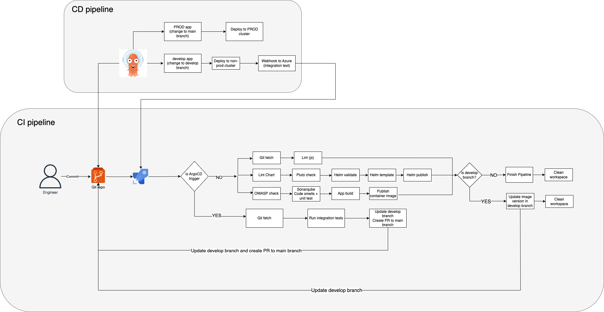
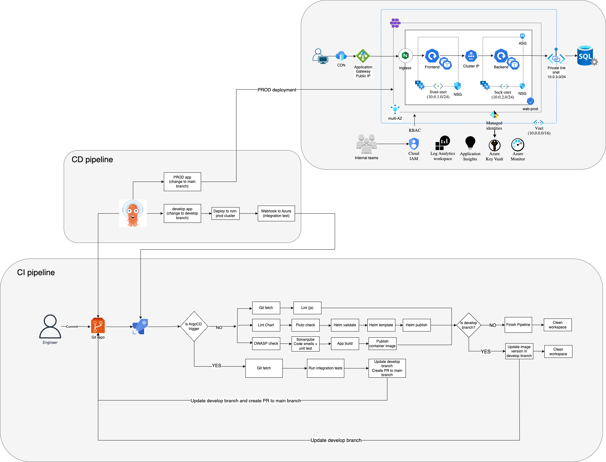

# Part 2: Deployment Architecture & Process for a 3-Tier Application

## 1. Architectural Diagrams

The CI/CD pipeline consists of separate CI (Continuous Integration) and CD (Continuous Deployment) workflows

- **CI Pipeline:** Managed in Azure DevOps for building, testing, security scanning, and publishing artifacts.
- **CD Pipeline:** Handled by Argo CD for automated deployment to Kubernetes.

The diagram below illustrates how the CI/CD pipelines interact with the AKS cluster for deployment

## 2. Design Annotations

### Assumptions

- **Source Control:** Azure DevOps for source control
- **Kubernetes Manifests:** Helm charts for application K8s manifests
- **Tech Stack:** JS for Frontend, and a Springboot app for backend
- **Build tool:** NPM for frontend, and Maven for Backend (not Gradle)
- **Code quality:** Sonarqube is available for running code smells
- **Continous Deployment:** Argo CD is available for CD integration
- **Development Approach:** Trunk-based for frequent releases and fewer merge conflicts
- **Automated Testing:** Separate test suites are written to run Integration tests against actual non-prod environments

### Pipeline stages

- Checkout and Lint

  - NPM lint for JavaScript
  - Maven Checkstyle for Java

- Helm Lint, Validate and Publish

  - Lint helm charts
  - Run Pluto check to detect deprecated APIs against the current Kubernetes and Cert Manager versions
  - Template, package and Publish Helm charts

- OWASP dependency, Sonarqube scan, App build

  - Run OWASP dependency check, generate a report, and fail the pipeline if high-severity CVEs are found
  - Perform SonarQube scan, run unit tests with Sonar analysis to detect code smells
  - Build docker images and push to Container registry

- Update helm config non-prod values.yaml

  - If the build is from the `develop` branch, update the `imageTag` in `values-non-prod.yaml` with the BuildID
  - GitOps ArgoCD listening on changes to `values-non-prod.yaml` will deploy the new changes to `non-prod.yaml`

- ArgoCD Trigger

  - Argo CD triggers a webhook with the custom parameter `triggeredbyArgoCD`
  - If `triggeredbyArgoCD` is `true`, checkout the `develop` branch, update `values-prod.yaml`, and raise a PR to merge `develop -> main`
  - Manual approval is required before merging into the main branch
  - ArgoCD triggers deployment to PROD cluster on merge.

### Deployment to additional non-prod environments

- For other non-prod environments, update the corresponding `values-<env>.yaml` file with the BuildID.
- ArgoCD will detect changes in the respective values file and trigger deployment to the appropriate environment.
